# Diagramas de estado del sistema Kryotec Admin

## Autenticación y seguridad

### AdminUser
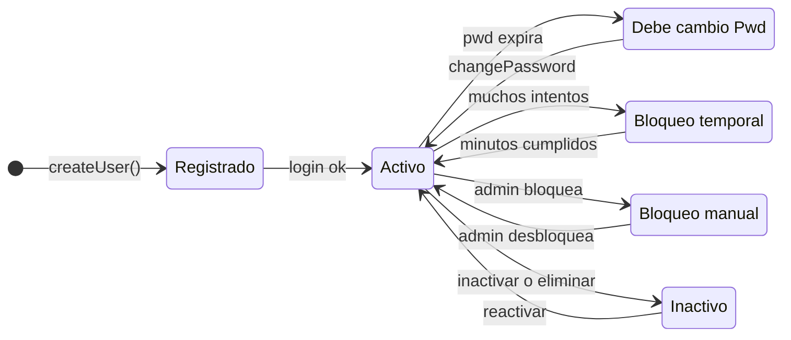

### Sesion administrativa (JWT)
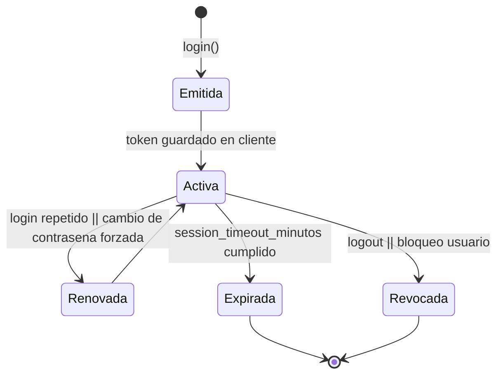

### Historial de contraseñas
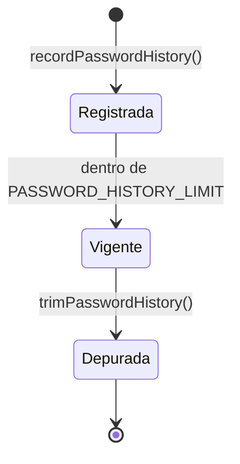

## Tenants y aprovisionamiento multiesquema

### Tenant global
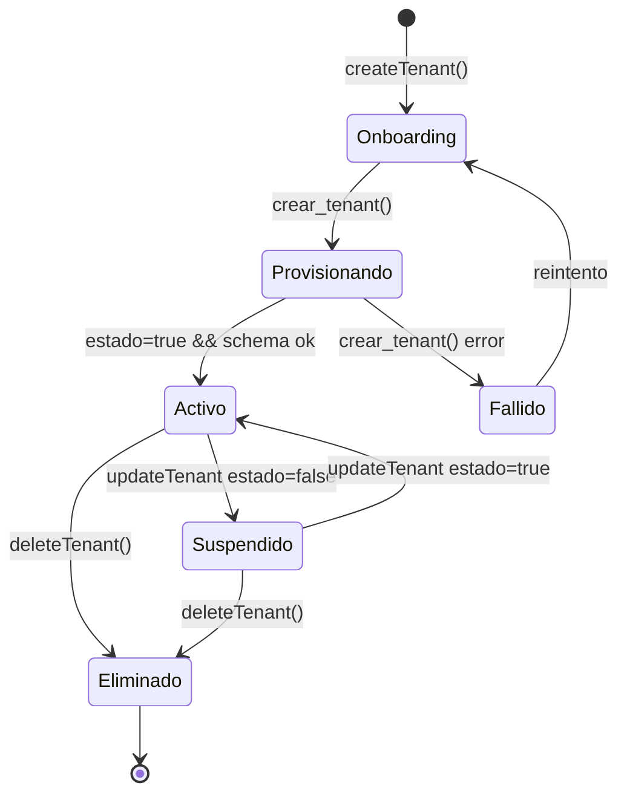

### Esquema por tenant
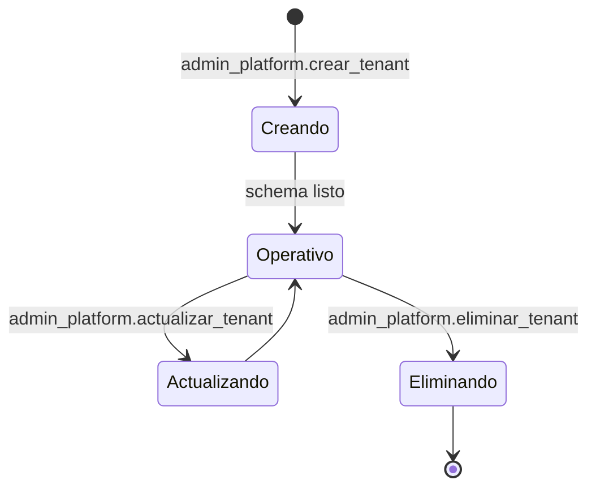

## CRM de prospectos

### ClienteProspecto
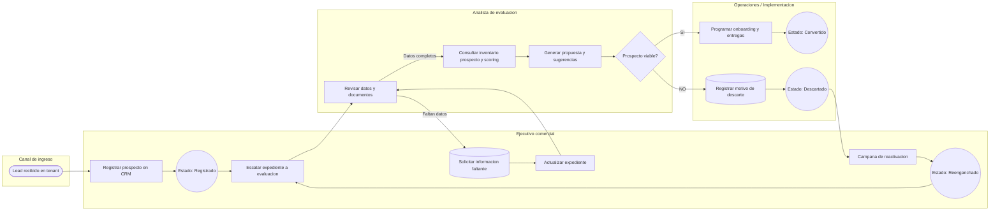

### InventarioProspecto
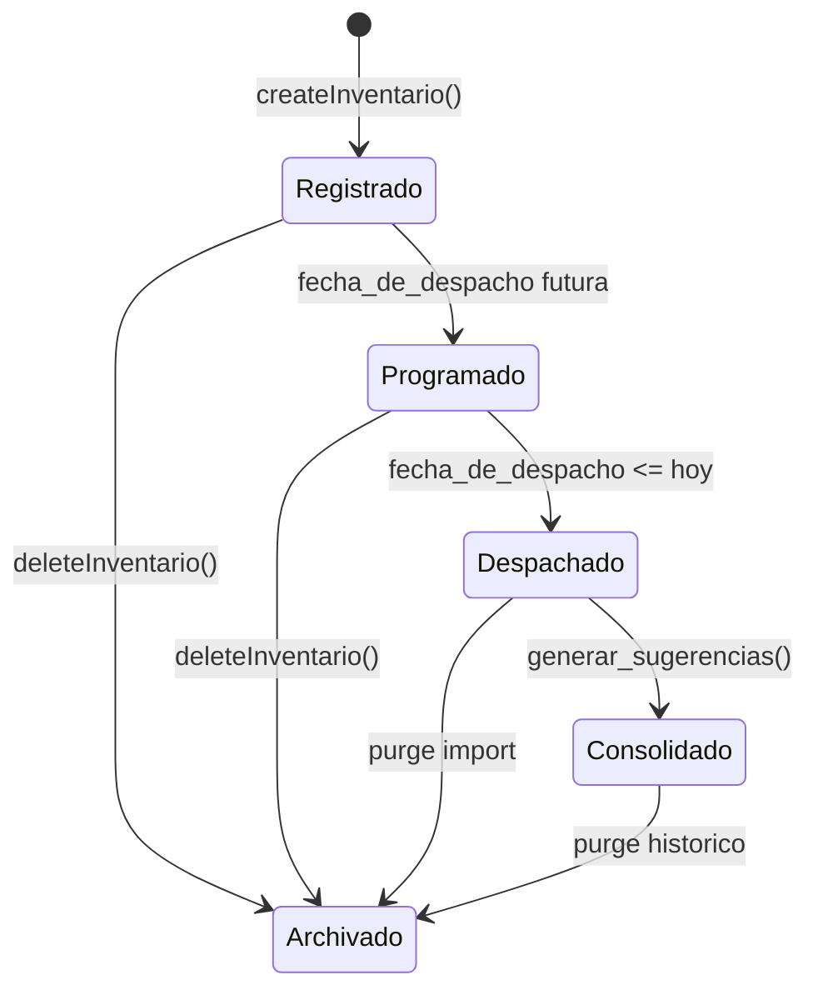

## Inventario central y modelos

### InventarioCredocube
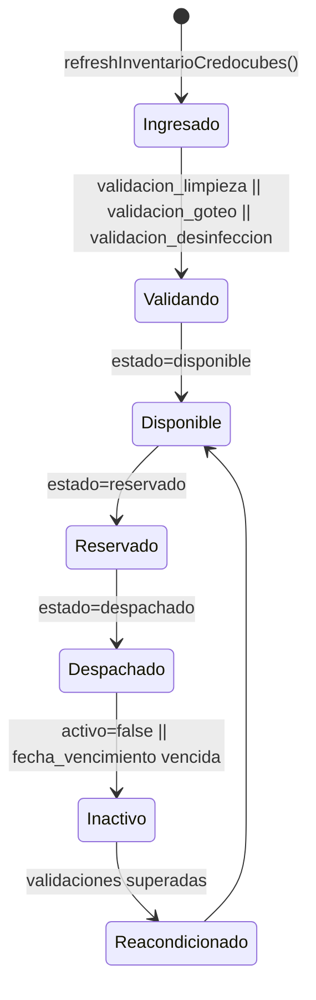

### Modelo Credocube
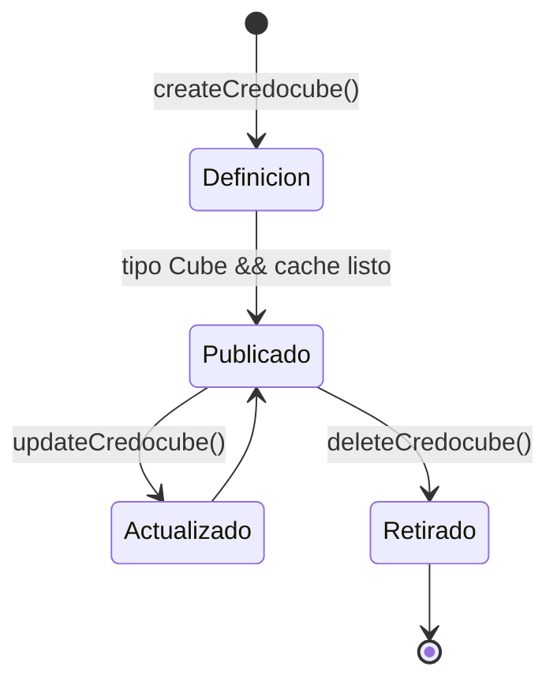

## Recomendaciones y logística

### SugerenciaReemplazo
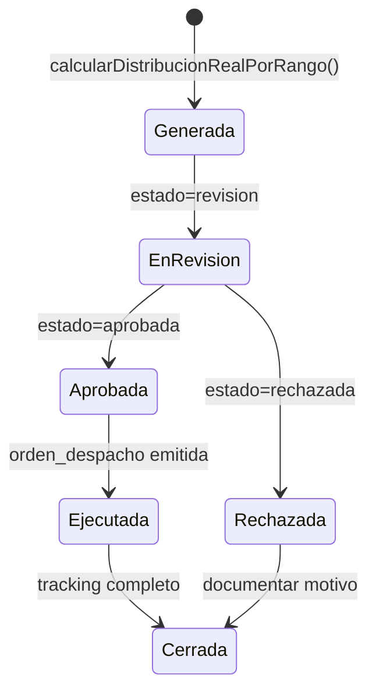

### Orden de despacho (inventario agregado)
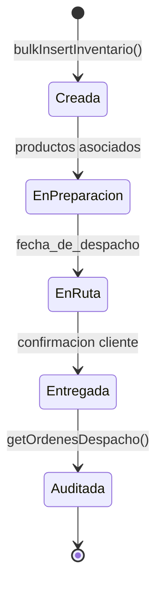